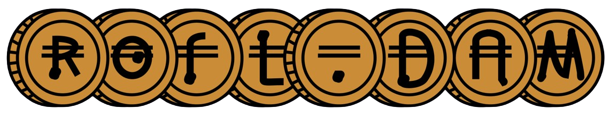

# ROFL.DAM

<h4 align="center">
  <p align="center">
    
  </p>
  <a href="https://rofl-dam.vercel.app/">Deployed app</a>
</h4>


A secure messaging platform that combines Oasis ROFL's trusted execution environment with decentralized, authenticated messaging capabilities.

## 🎯 Problem

ROFL.DAM (**R**untime **O**ff-chain **F**unction **L**ogic **D**ecentralized **A**uthenticated **M**essaging) solves key problems of traditional chat platforms by giving users full control, privacy, and resilience through decentralization. Unlike centralized tools prone to censorship, surveillance, and opaque moderation, ROFL.DAM uses Nostr for censorship-resistant real-time chat, MongoDB for secure group data storage, and a user-friendly frontend for group creation, joining, and management.

## 🚀 Solution

A Web3-enabled chat platform running on OASIS ROFL where users can create or join groups, chat via a Nostr relay, and manage group membership with help from MongoDB. For the first time, your chat data is truly yours: decentralized, autonomous, and secure.

## 🌟 Key Features

- 🔒 **Secure Message Processing**: Messages are processed within TEE, ensuring confidentiality and integrity
- 🔐 **NFT-Gated Access**: Control chat access using NFT ownership on Oasis Sapphire Testnet
- 🔄 **Off-chain Logic**: Computations and message processing handled by ROFL runtime
- 🏗 **Built with Scaffold-ETH 2**: Leveraging modern web3 development tools
- 💬 **Censorship-Resistant**: Built on Nostr protocol for decentralized communication

## 🏗 Architecture

The project consists of three main components:

1. **Frontend (NextJS)**
   - User interface for chat interactions
   - Group creation and management
   - Located in `packages/nextjs/`

2. **ROFL Backend**
   - Secure message processing in TEE
   - MongoDB integration for message storage
   - Nostr protocol integration for message relay
   - Located in `packages/rofl/`

3. **Oasis Smart contracts**
   - Collection creation and NFT Minting
   - NFT verification and access control
   - Located in `packages/foundry/`

## 🚀 Quickstart

- Install dependencies:
```bash
yarn install
```

- Start the NextJS frontend:
```bash
yarn start
```

## 🔧 Development

- Frontend code is in `packages/nextjs/app/`
- Smart contracts are in `packages/foundry/contracts/`
- ROFL backend code is in `packages/rofl/`
- Contract deployment scripts are in `packages/foundry/script/`

## 🔐 Security Features

- Messages are processed within Trusted Execution Environment (TEE)
- Integration with Sapphire for secure key management
- NFT-based access control for chat rooms
- Off-chain message processing for better scalability
- Censorship-resistant communication via Nostr

## 🏆 Oasis

This project is built for the Oasis ROFL and Oasis Sapphire track, leveraging:
- Runtime Off-chain Logic (ROFL) for secure computation
- NFT smart contract deployed on Oasis Sapphire Testnet
- TEE-based execution for enhanced security

## 🔮 Next Steps

- Implement chat filtering and search functionality
- Add support for premium/pump chats
- Develop chat rules and moderation tools
- Integrate pay-to-send message features
- Conduct security and privacy audits
- Optimize Nostr relay performance
- Enhance MongoDB scalability
- Improve UX for group management

# Links
- [ChatAccessNFT.sol on Oasis Sapphire Testnet](https://pr-1777.oasis-explorer.pages.dev/testnet/sapphire/address/0xF2A83DF3190c5F2E31c56E1cEFf71A783548899C)
- [Github repo](https://github.com/rofl-fun/mono)
- [Live deployment on Vercel](https://rofl-dam.vercel.app/)

## 👥 Team

- [0xjsi.eth](https://x.com/0xjsieth) - Solidity Developer
- [maarten](https://github.com/11029358) - Design and UX
- [pitycake](https://twitter.com/pitycake) - Devops
- [arjanjohan](https://twitter.com/arjanjohan) - Fullstack Developer
